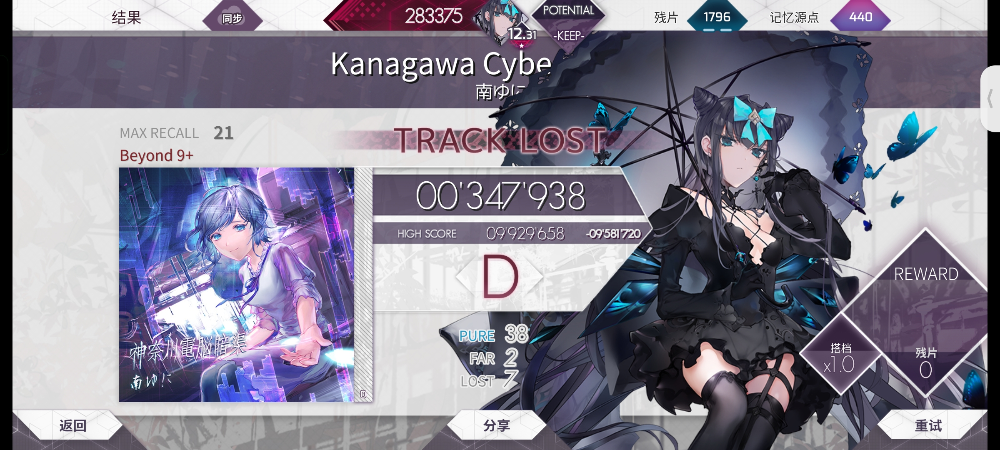
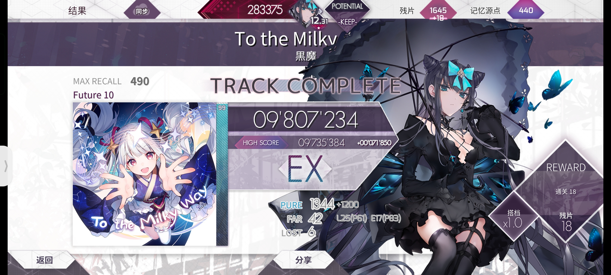

# Arcaea Offline OCR

## Example

```py
import json
import pytesseract

pytesseract.pytesseract.tesseract_cmd = r'D:/path/to/your/tesseract.exe'

from arcaea_offline_ocr import device, recognize

with open("./assets/devices.json", "r", encoding="utf-8") as file:
    my_device = device.Device.from_json_object(json.loads(file.read())[0])
print(recognize.recognize('./assets/screenshots/RMX3370_byd_1.jpg', my_device))
```



```
RecognizeResult(pure=38, far=2, lost=7, score=347938, max_recall=21, rating_class=3, title='Kanagawa Cybe')
```

<hr>

```py
print(recognize.recognize('./assets/screenshots/RMX3370_ftr_1.jpg', my_device))
```



```
RecognizeResult(pure=1344, far=42, lost=6, score=9807234, max_recall=490, rating_class=2, title='To the Milkv')
```
